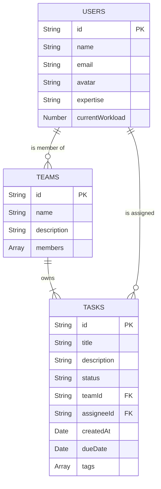

# Thiết kế Back-end cho Ứng dụng Quản lý Công việc TeamFlow với Next.js

Tài liệu này mô tả chi tiết kiến trúc back-end được đề xuất cho ứng dụng TeamFlow, được xây dựng trực tiếp bên trong Next.js, tận dụng các tính năng full-stack của framework.

## 1. Công nghệ đề xuất
- **Nền tảng:** Next.js (App Router)
- **Ngôn ngữ:** TypeScript
- **Styling:** Tailwind CSS & shadcn/ui
- **Cơ sở dữ liệu:** MongoDB
- **Thư viện tương tác DB:** Mongoose
- **Xử lý tác vụ phía server:** Next.js Server Actions
- **Xử lý tác vụ AI:** Genkit

---

## 2. Kiến trúc Back-end với Server Actions

Thay vì tạo một server Express.js riêng biệt, chúng ta sẽ tận dụng **Server Actions** của Next.js để xử lý toàn bộ logic phía máy chủ một cách an toàn và hiệu quả.

### 2.1. Cấu trúc thư mục liên quan đến Back-end

Cấu trúc back-end được tích hợp ngay trong thư mục `src` của Next.js:

```
src/
|
├── app/
│   ├── actions.ts             // Định nghĩa các Server Actions để tương tác với DB (CRUD)
│   └── (routes)/              // Các component trang (Client & Server Components)
│       └── page.tsx           // Gọi Server Actions từ các Client Components
|
├── ai/
|   ├── flows/                 // Chứa các flow Genkit để xử lý logic AI
|   |   └── suggest-task-assignee.ts
|   └── genkit.ts              // Cấu hình Genkit
|
├── lib/
│   ├── mongodb.ts             // Quản lý kết nối đến MongoDB
│   └── models.ts              // Định nghĩa Mongoose Schemas và Models
|
└── types.ts                   // Định nghĩa các kiểu dữ liệu chung (User, Task, Team)
```

### 2.2. Luồng xử lý dữ liệu

1.  **Client Component (Ví dụ: Form tạo task):** Người dùng tương tác với giao diện.
2.  **Gọi Server Action:** Component phía client gọi một hàm `async` được export từ `src/app/actions.ts`. Ví dụ: `addTask(taskData)`.
3.  **Thực thi trên Server:**
    *   Hàm trong `actions.ts` (được đánh dấu `"use server";`) sẽ được thực thi **chỉ trên server**.
    *   Action này kết nối tới MongoDB (thông qua `mongodb.ts`) và sử dụng các Mongoose Model (`models.ts`) để thực hiện các thao tác CRUD (Create, Read, Update, Delete) với cơ sở dữ liệu.
4.  **Trả về kết quả & Cập nhật UI:**
    *   Server Action có thể trả về dữ liệu cho client.
    *   Next.js có thể tự động làm mới dữ liệu (revalidate) trên trang, giúp giao diện người dùng được cập nhật với thông tin mới nhất.

---

## 3. Thiết kế Cơ sở dữ liệu (MongoDB Collections)

### 3.1. Sơ đồ quan hệ

- **Users ◄—► Teams (Quan hệ nhiều-nhiều được nhúng):** Một người dùng có thể thuộc nhiều team, và một team có nhiều thành viên. Thông tin thành viên (user ID và role) được nhúng trực tiếp vào trong document của Team.
- **Teams —► Tasks (Một-nhiều):** Một team có thể có nhiều task. Mối quan hệ được thể hiện qua `teamId` trong collection `tasks`.
- **Users —► Tasks (Một-nhiều - vai trò Assignee):** Một người dùng có thể được giao nhiều task. Mối quan hệ được thể hiện qua `assigneeId` trong collection `tasks`.



### 3.2. Mô tả các Collections (Bảng)

#### `users`
Lưu trữ thông tin chi tiết về từng người dùng.
- **`_id`** (String): Khóa chính, định danh duy nhất cho người dùng.
- **`name`** (String): Tên đầy đủ của người dùng.
- **`email`** (String): Email, dùng để đăng nhập (unique).
- **`avatar`** (String): URL đến ảnh đại diện.
- **`expertise`** (String): Mô tả ngắn về chuyên môn (ví dụ: "Frontend Development", "UI/UX Design").
- **`currentWorkload`** (Number): Chỉ số thể hiện khối lượng công việc hiện tại.

#### `teams`
Tổ chức người dùng vào các nhóm làm việc.
- **`_id`** (String): Khóa chính, định danh duy nhất cho team.
- **`name`** (String): Tên của team.
- **`description`** (String): Mô tả ngắn về mục tiêu, nhiệm vụ của team.
- **`members`** (Array of Objects): Danh sách các thành viên trong team.
  - **`user`** (ObjectId, ref: 'User'): Tham chiếu đến `_id` của người dùng trong collection `users`.
  - **`role`** (String): Vai trò của thành viên ('leader' hoặc 'member').

#### `tasks`
Lưu trữ thông tin chi tiết về các công việc cần thực hiện.
- **`_id`** (String): Khóa chính, định danh duy nhất cho task.
- **`title`** (String): Tiêu đề của công việc.
- **`description`** (String): Mô tả chi tiết về công việc.
- **`status`** (String): Trạng thái hiện tại của công việc (`backlog`, `todo`, `in-progress`, `done`).
- **`assignee`** (ObjectId, ref: 'User', nullable): Tham chiếu đến `_id` của người được giao việc. Có thể là `null` nếu chưa được giao.
- **`team`** (ObjectId, ref: 'Team'): Tham chiếu đến `_id` của team sở hữu công việc này.
- **`createdAt`** (Date): Ngày tạo công việc.
- **`startDate`** (Date, optional): Ngày bắt đầu dự kiến.
- **`dueDate`** (Date, optional): Ngày hết hạn.
- **`tags`** (Array of Strings): Các nhãn để phân loại công việc (ví dụ: `['design', 'bug', 'feature']`).
